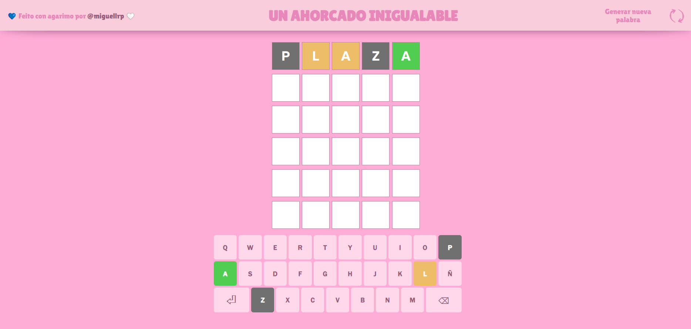

# 💀 Un ahorcado inigualable
_Pequeño proyecto con la finalidad de integrar las diferentes funcionalidades que ofrecen CSS y JS en un juego de ahorcado que es inigualable (y para nada inspirado en el Wordle)._

## 🪄 Demo
https://miguellrp.github.io/Ahorcado_Inigualable/

## 📋 Requisitos
* Se escogerá una palabra al azar que se tendrá que adivinar. Se tendrán 6 intentos, y a lo largo de estos se facilitarán dos pistas:
    * 🟠 La palabra contiene esta letra, pero no está en la posición indicada.
    * 🟢 La palabra contiene esta letra y está en la posición indicada.
* Los inputs podrán realizarse tanto por teclado como por teclado en pantalla.
* Habrá otra pantalla que felicite o dé un ánimo (si se adivinó la palabra o no, respectivamente -y, en este último caso, se mostrará la palabra que debía ser adivinada-).
* Se hará uso de la modularización en CSS y de los Imports / Exports en JS con la finalidad de tener un código _más segmentado_*.
* Se dispondrá de un botón que reinicie la partida, generando una nueva palabra a adivinar (sin reiniciar la página).
* Todo deberá operar en la misma página: tanto la pantalla durante el transcurso de la partida como la pantalla del resultado se definirán en el propio "index.html" (la transición entre estas se configurará mediante id's, clases y scripts a través del uso del DOM).

*: Que estea _más segmentado_ no significa que estea _correctamente segmentado_. 

## 🛠️ Características a arreglar / mejorar
* La revelación de los colores de las letras no están correctamente implementadas, de forma que, por ejemplo, las letras-input que están en la posición correcta se revelan antes que el resto.
* Permitir seleccionar en cada fila de casillas la columna que se desee, de manera que no obligue a escribir la palabra de principio a fin linealmente.
* Reestructurar el script "main.js" de forma que se pueda segmentar en una organización más comprensible.
* Pulir el apartado responsive.
* ¿Mudarse a ~~TypeScript~~ React 👀? De manera que se tenga una estructura de código más declarativa, en lugar de tan imperativa (más costosa en cuanto a mantenimiento).

## 📎Lo utilizado

